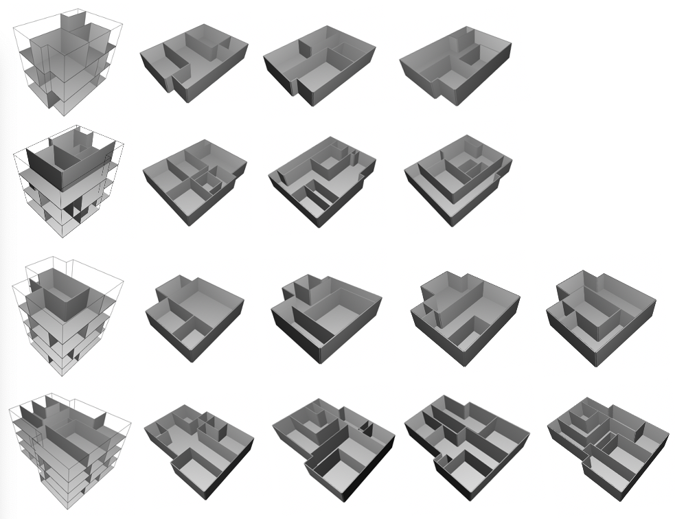

## Dependencies

```c
Python==3.7.0, PyTorch==1.4.0, easydict, numpy==1.16.1, shapely, open3d
```

## Training

1. Download the dataset:

   * [MultiLayerDataset (Baidu Yun)](https://pan.baidu.com/s/1aA5gs-sDABsbL667F_cCbA) Password:t9x9
   * [MultiLayerDataset (Google Drive)](https://drive.google.com/file/d/1DCMdZiLoS2W6-uZb91yk2SgQZcP6rko8/view?usp=sharing)

2. Change your own dataset path in the config file (e.g. layout_generator_test.yml)

3. Train the Evaluator Model

   ```python
   python main.py --cfg cfg/layout_evaluator.yml --gpu 0
   ```

4. Train the Generator Model

   ```python
   python main.py --cfg cfg/layout_generator.yml --gpu 0
   ```

## Run example

```c
python main.py --cfg cfg/layout_generator_test.yml --gpu 0
```

<p align="center">

<p align="center">
Figure: Qualitative Results of Multi-story Building Layout.
</p>


## Generate your own Dataset (Optional)

1. Generate random room layers from the profile of the ground layer (train data for the Generator)

   ```python
   cd dataset/GenerateData
   python GenerateTrainData.py
   ```

2. Prepare the train data for the Evaluator

   ```python
   cd dataset
   python Preprocess.py
   ```

