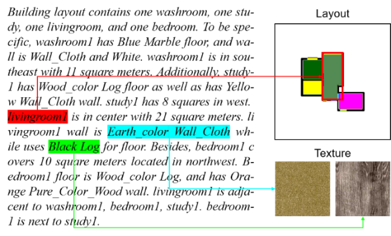
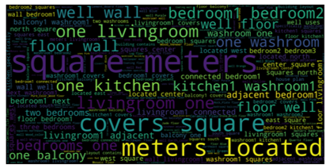

# Intelligent Home 3D: Automatic 3D-House Design from Linguistic Descriptions Only

Pytorch implementation for “Intelligent Home 3D: Automatic 3D-House Design from Linguistic Descriptions Only”

In this paper, we formulate home design as a language conditioned visual content generation problem that is further divided into a floor plan generation and an interior texture (such as floor and wall) synthesis task. The only control signal of the generation process is the linguistic expression given by users that describe the house details. To this end, we propose a House Plan Generative Model (HPGM).

<p align="center">

</p>
<p align="center">
Figure: An example of generated 3D house with description using HPGM on the Text--to--3D House Model dataset.
</p>


## Framework

The proposed HPGM consists of five components: 
1. text representation block
2. graph conditioned layout prediction network (GC-LPN)
3. floor plan post-processing
4. language conditioned texture GAN (LCT-GAN)
5. 3D scene generation and rendering


<p align="center">

</p>
<p align="center">
Figure: The overview framework of HPGM.
</p>


## Dependencies

```
Python==2.7, PyTorch==0.4.1, torchvision==0.2.1
```

## Dataset

In our paper, to train and evaluate our model, we build the first Text--to--3D House Model dataset.
The dataset contains 2,000 houses, 13,478 rooms and 873 (some rooms have same textures so this number is smaller than the total number of rooms.) texture images with corresponding natural language descriptions. These descriptions are firstly generated from some pre-defined templates and then refined by human workers. The average length of the description is 173.73 and there are 193 unique words.
In our experiments, we use 1,600 pairs for training while 400 for testing in the building layout generation. For texture synthesis, we use 503 data for training and 370 data for testing.

- Download Text--to--3D House Model dataset:

1. [Text--to--3D House Model (Baidu Yun)](https://pan.baidu.com/s/1C88zjcYIAKRiqVD5Qlj7yQ) Password: n7ty

2. [Text--to--3D House Model (Google Drive)](https://drive.google.com/drive/folders/1SrmnPq47QZSN1mlllMli2rfXtxyMeA0m?usp=sharing)


<p align="center">

</p>
<p align="center">
Figure: An example from Text--to--3D House Model dataset (left) and the word cloud of the texts in our dataset (right).
</p>


## Training
- Train GC-LPN
```
python main.py --cfg cfg/layout.yml --gpu '0'
```

- Train LCT-GAN
```
CUDA_VISIBLE_DEVICES=3 python main.py
--texturePath=/home/chenqi/dataset/materials/
--ngf=80 --ndf=80 --zLoc=100 --zGL=31 --nDep=5
--nDepD=5 --batchSize=24 --niter=10000
--coeff_color_loss=0 --imageSize 160
--use_perceptual_loss=1
```

## Testing
- Test GC-LPN
```
python main.py --cfg cfg/layout_test.yml --gpu '0'
```


## Generated examples

We provide some visualised layouts and textures results compared with baseline methods.

<p align="center">

</p>
<p align="center">
Figure: The examples of layouts produced by GC-LPN (left) and textures generated by LCT-GAN (right).
</p>

## Citation

If you use any part of this code in your research, please cite our paper:

```
@inproceedings{chen2020intelligent,
  title={Intelligent home 3d: Automatic 3d-house design from linguistic descriptions only},
  author={Chen, Qi and Wu, Qi and Tang, Rui and Wang, Yuhan and Wang, Shuai and Tan, Mingkui},
  booktitle={Proceedings of the IEEE/CVF Conference on Computer Vision and Pattern Recognition},
  pages={12625--12634},
  year={2020}
}

```

