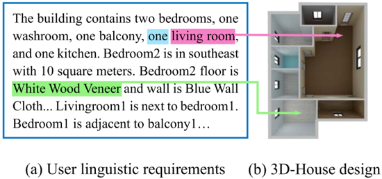
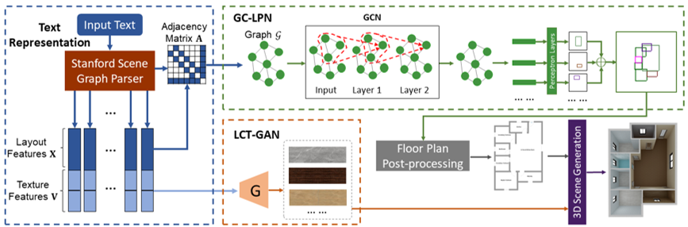
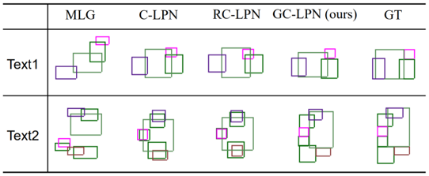
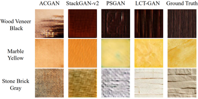

## HPGM

Pytorch implementation for “Intelligent Home 3D: Automatic 3D-House Design from Linguistic Descriptions Only”

<div align=center></div>

## Framework

<div align=center></div>

## Dependencies

Python 2.7

Pytorch

## Dataset
In our paper, to train and evaluate our model, we build the first Text--to--3D House Model dataset.

- Download [Text--to--3D House Model](https://github.com) dataset.


## Training
- Train GC-LPN
```
python xxx.py
```

- Train LCT-GAN
```
python xxx.py
```


## Evaluation Metrics

- Calculate the IoU
```
python xxx.py
```

- Calculate the Fréchet Inception Distance (FID)
```
python xxx.fid
```

- Calculate the MS-SSIM
```
pythono xxx.py
```


## Generated examples

We provide some generated layouts by using GC-LPN and the baseline methods.
We provide some generated layouts by using LCT-GAN and the baseline methods.

<p align="center">

</p>
<p align="center">
Figure: The layouts produced by GC-LPN and baselines.
</p>


## Citation

If you use any part of this code in your research, please cite our paper:

```
@inproceedings{chen2020intelligent,
  title={Intelligent Home 3D: Automatic 3D-House Design from Linguistic Descriptions Only},
  author={Chen, Qi and Wu, Qi and Tang, Rui and Wang, Yuhan and Wang, Shuai and Tan, Mingkui},
  booktitle={Proceedings of the IEEE Conference on Computer Vision and Pattern Recognition},
  year={2020}
}

```

